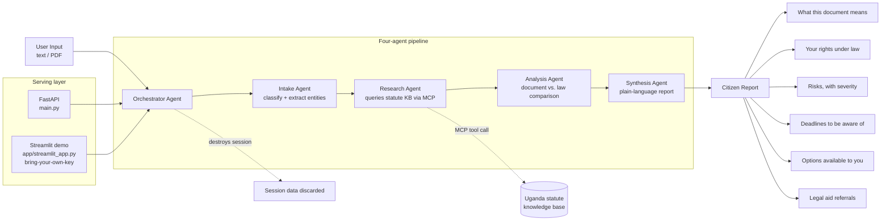

# Sheria Yangu — Know Your Rights Uganda

> *Sheria* means "law" in Swahili. Every Ugandan citizen deserves to understand the documents that affect their life.

Sheria Yangu is an AI-powered multi-agent system that helps Ugandan citizens understand their legal documents in plain language. Upload or paste a contract, notice, or summons, and the system tells you what the document says, what Ugandan law says, what your rights are, and what options are available to you.

**Sheria Yangu provides legal information, not legal advice.** It surfaces what the law says versus what your document says. For advice specific to your situation, consult a qualified advocate.

🚀 **[Try the live demo](#running-the-demo)** — bring your own free Google API key, paste a document, see a real analysis
📄 **[Kaggle notebook](notebooks/sheria_yangu_demo.ipynb)** — three worked examples, no setup needed

---

## The Problem

Access to legal information in Uganda is a privilege. A citizen who receives an eviction notice, a police summons, or an employment contract they are pressured to sign immediately is at a significant disadvantage if they cannot afford an advocate. Sheria Yangu closes that gap — not by replacing advocates, but by ensuring every citizen walks into that conversation already knowing their rights.

## Business relevance

The practical outcome this targets is access to justice, not a model metric: the gap between "knows their rights" and "doesn't" is what decides whether a citizen negotiates from a position of knowledge or signs/vacates/complies out of fear and information asymmetry. A generic chatbot answering legal questions doesn't close this gap — what does is comparing *this specific document* against *what the law actually says*, in plain language, in minutes, for free. That's the product decision behind the four-agent pipeline (intake → research → analysis → synthesis) rather than a single-shot LLM call: each stage is auditable, and the Analysis Agent is constrained (by prompt and by design) to factual comparison only — "the document says X, the law says Y" — never "you should do Z," which is what keeps this legal *information* rather than legal *advice*, and keeps liability and scope honest.

---

## Architecture



### Agent responsibilities

| Agent | Job |
|---|---|
| **Intake** | Classifies document type, extracts entities (parties, dates, amounts, obligations) |
| **Research** | Queries the Uganda statute knowledge base for relevant provisions |
| **Analysis** | Compares what the document says vs what the law says; flags risks and deadlines |
| **Synthesis** | Rewrites findings in plain language; surfaces rights and options |
| **Orchestrator** | Coordinates the pipeline; destroys session data after completion |

### Key concepts demonstrated (Kaggle course requirements)

- ✅ **Multi-agent system (ADK)** — Orchestrator + four specialist agents
- ✅ **MCP Server** — `mcp_tools/server.py` exposes the statute knowledge base as a tool, called via an in-process FastMCP client from the Research Agent
- ✅ **Security** — Session-scoped only, no PII/document content persists to disk, plus rate limiting, input size limits, restricted CORS, and security headers (see [Security & privacy](#security--privacy))

---

## Results

`scripts/evaluate_pipeline.py` scores the pipeline against the three worked-example
documents (eviction notice, employment contract, police summons) on three axes:

- **Schema validity** — did every agent stage return well-formed output the next stage
  (and the API response model) could actually consume?
- **Rubric pass rate** — a small, hand-written check per document: did the analysis at
  least surface the one obviously-relevant issue (e.g. the eviction notice's 3-day
  period, the employment clause's below-statutory notice period, the summons' right to
  legal representation)? This is a keyword/field-presence check, not a legal-accuracy
  certification — see [Security & privacy](#security--privacy) for why that distinction
  matters here.
- **Latency** — wall-clock time per full four-agent pipeline run.

Run it yourself (needs a real API key, so numbers aren't hardcoded here):
```bash
python -m scripts.evaluate_pipeline
```
Results are written to `scripts/eval_results.json` and printed as a summary table.

---

## Scalability considerations

This is a portfolio-scale demo, not a production service, but the constraints that
would actually matter at scale:

- **Every request is a real LLM cost** — four sequential model calls per document
  (intake → research → analysis → synthesis), unlike a typical ML demo with zero
  per-request inference cost. This is why the public demo asks each visitor for their
  own API key rather than sharing one (see [Running the demo](#running-the-demo)).
- **The four agent calls are currently sequential**, not parallel — Research depends on
  Intake's output, and Analysis depends on Research's, so the pipeline has a real
  dependency chain. There's no obvious win from parallelizing this specific chain, but
  running Research's statute lookups concurrently with entity-extraction refinement
  would be the first place to look if latency became a problem at real usage volume.
- **Statute lookups are repeatable** — the same document type (e.g. "Eviction Notice")
  triggers largely the same statute queries. A cache keyed on document type + a coarse
  entity fingerprint would cut Research Agent latency/cost for the most common document
  types without touching correctness.
- **Rate limiting (`RATE_LIMIT_PER_MINUTE`, default 10/min per IP)** is the current
  abuse control on the FastAPI service — the natural next step at real scale is a queue
  in front of the LLM-backed endpoints rather than synchronous rate-limited rejection.

## Monitoring (stated plan, not built)

A production version would track: **schema-validity rate** over time (a drop signals
either a prompt regression or an upstream model change breaking the expected JSON
shape), **latency p50/p95** per agent stage (not just the pipeline total, since a single
slow stage should be diagnosable), and **rate-limit trigger frequency** as an abuse
signal distinct from organic traffic growth. None of this is built out here — a demo
doesn't have production traffic to monitor — but it's what "done" would mean beyond
this repo, same honesty bar as stating it rather than building an unused dashboard.

---

## Setup

```bash
git clone https://github.com/crisomara/sheria_yangu
cd sheria_yangu
pip install -r requirements.txt
cp .env.example .env
# Add your GOOGLE_API_KEY to .env (free at https://aistudio.google.com/apikey).
# To use OpenAI or OpenRouter instead, set USE_GOOGLE_API = False in config.py.
uvicorn main:app --reload
```

API is available at `http://localhost:8000`. Interactive docs at `/docs`.

## Running the demo

### Streamlit (bring your own key)

```bash
streamlit run app/streamlit_app.py
```

Opens a local web UI. Paste a free Google API key (get one at
[aistudio.google.com/apikey](https://aistudio.google.com/apikey)) and either paste
document text, upload a PDF, or pick one of the three worked examples. The key is used
only for your own request — it's never logged, written to disk, or persisted (same
session-destruction guarantee the API gives, see [Security & privacy](#security--privacy)).
This app doesn't call the FastAPI service over HTTP — it imports the same agent pipeline
directly, one process to host, no second point of failure for a portfolio demo. Deployed
on [Streamlit Community Cloud](https://streamlit.io/cloud) (free, no card required),
same platform as the Music Recommender project — Hugging Face Spaces was the original
target but now requires a PRO subscription for any Space with real compute (Gradio or
Docker SDK), so this was rebuilt from an earlier Gradio version rather than paying to
host a portfolio demo.

### Via the Kaggle notebook

Open `notebooks/sheria_yangu_demo.ipynb` and run all cells. Three worked examples are
provided: eviction notice, employment contract, police summons. No setup beyond a
Kaggle account.

### Via the API

```bash
curl -X POST http://localhost:8000/analyse/text \
  -H "Content-Type: application/json" \
  -d '{"text": "You are hereby required to vacate the premises within 3 days..."}'
```

## Running with Docker

```bash
docker build -t sheria-yangu-api .
docker run -p 8000:8000 -e GOOGLE_API_KEY=your-key-here sheria-yangu-api
```

The API key is passed at run time (`-e` / `--env-file`), never baked into the image.

---

## Document types supported

- Employment Contract / Termination Notice
- Eviction Notice / Notice to Vacate
- Police Summons
- Land Agreement
- Tenancy Agreement
- Loan Agreement
- Court Order
- Government Notice

---

## Legal knowledge base

Provisions drawn from:
- Constitution of Uganda 1995 (as amended)
- Employment Act 2006 (Cap. 219)
- Landlord and Tenant Act 2022
- Land Act 1998 (Cap. 227)
- Police Act 2006 (Cap. 303)
- Contracts Act 2010
- Tier 4 Microfinance Institutions and Moneylenders Act 2016

---

## Legal referrals

Sheria Yangu always includes referral information in every report:

| Organisation | Contact |
|---|---|
| Uganda Law Society | 0414-254848 |
| FIDA Uganda (free legal aid for women) | 0414-530848 |
| LASPNET | laspnet.org |
| Uganda Human Rights Commission (toll-free) | 0800-200-500 |

---

## Security & privacy

**Data handling:**
- No document content is written to disk at any point
- Sessions are in-memory only, server-generated UUIDs (never client-suppliable), expire after 10 minutes, and are explicitly destroyed after each pipeline run
- No user data is logged or retained between requests
- The public Streamlit demo takes each visitor's own API key, used only for their request, never logged or stored — see [Running the demo](#running-the-demo)

**API hardening:**
- **CORS** denies all cross-origin browser requests by default. Set `ALLOWED_ORIGINS` in `.env` (comma-separated) once you have a real frontend origin to allow. This does not affect non-browser clients — curl, the Kaggle notebook, `requests`/`httpx` calls are unaffected by CORS either way.
- **Rate limiting**: `/analyse/text` and `/analyse/file` are capped at `RATE_LIMIT_PER_MINUTE` (default 10) requests/minute per client IP — keeps one client from burning through the LLM quota shared by everyone using a given deployment.
- **Input limits**: request text is capped at `MAX_TEXT_LENGTH` (default 20,000 chars); file uploads are capped at `MAX_UPLOAD_BYTES` (default 10 MB) and checked incrementally while reading, so an oversized upload can't be used to exhaust server memory. Only `application/pdf` and `text/plain` are accepted.
- Security headers (`X-Content-Type-Options`, `X-Frame-Options`, `Referrer-Policy`) are set on every response.
- Errors return actionable JSON (missing key, upstream provider failure, malformed model output, rate limit, validation) without leaking internals like stack traces or the API key.

**Not covered — deliberately out of scope for now:**
- No end-user authentication. This is intentional: the product's mission is open access for citizens, not a gated service. If you deploy this publicly, the rate limiting above is your main abuse control, not auth.
- No TLS/HTTPS termination — that's a deployment-layer concern (reverse proxy / hosting platform), not application code.
- The knowledge base and risk analysis have not been reviewed by a licensed advocate. Treat this as a working prototype, not a source of truth, until that review happens. This is also why `scripts/evaluate_pipeline.py`'s rubric checks are described as a regression signal, not a legal-accuracy certification.

---

## Structure

```
agents/
  orchestrator.py      # coordinates the 4-agent pipeline, destroys session on completion
  intake.py             # classify document, extract entities
  research.py            # query statute KB via MCP
  analysis.py             # document-vs-law comparison, risk/deadline extraction
  synthesis.py             # plain-language citizen report
knowledge/
  uganda_statutes.py    # statute knowledge base
mcp_tools/
  server.py              # exposes the knowledge base as an MCP tool
utils/
  llm.py                 # shared LLM call helper with model fallback
  session.py               # in-memory, TTL-expiring, session-destroying session store
app/
  streamlit_app.py        # Streamlit demo, bring-your-own-key
scripts/
  evaluate_pipeline.py   # scored evaluation harness (schema validity, rubric, latency)
tests/
  test_pipeline.py        # manual smoke test (3 worked examples)
notebooks/
  sheria_yangu_demo.ipynb # Kaggle demo notebook
main.py                    # FastAPI entry point
config.py                   # provider/model config (Google default, OpenAI/OpenRouter alternate)
Dockerfile                   # containerizes main.py
CHECKLIST.md                  # portfolio-readiness checklist for this project
```

---

## License

MIT — see [LICENSE](LICENSE).

---

## Disclaimer

Sheria Yangu provides legal information based on Ugandan law, not legal advice. For advice specific to your situation, consult a qualified advocate or contact the Uganda Law Society.
